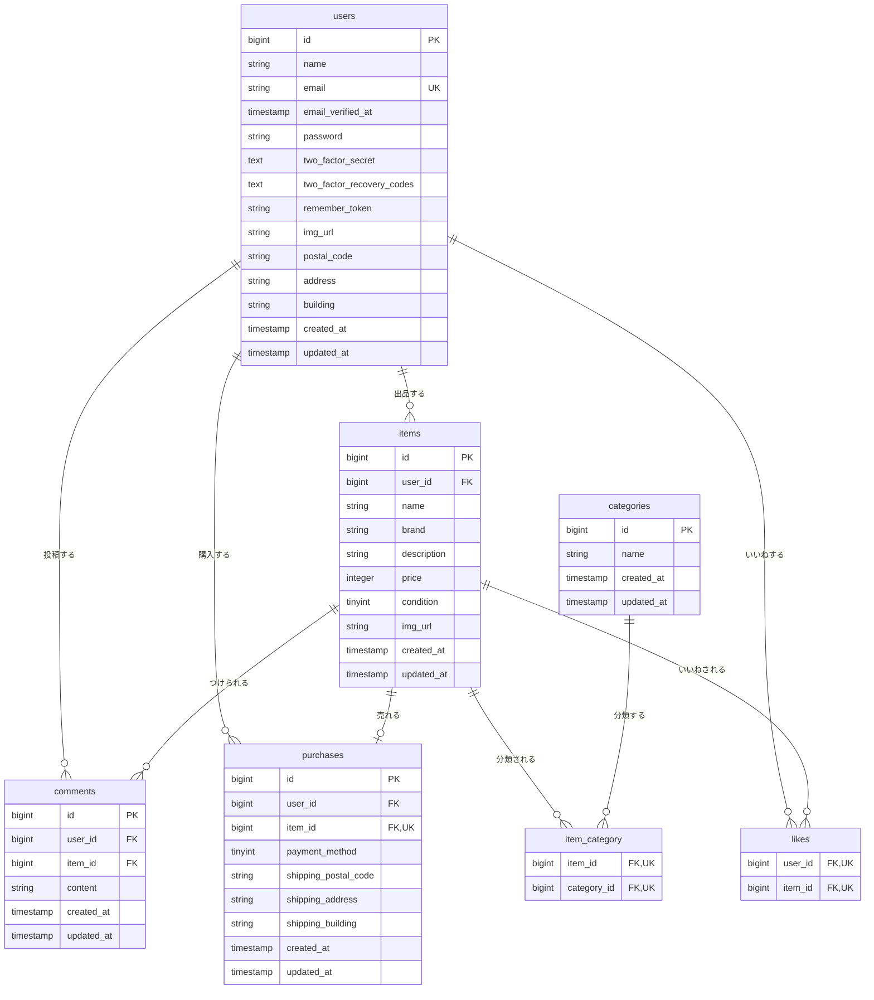

# flea-market-app
## 環境構築
### Dockerビルド
- git clone https://github.com/kayame0120-code/flea-market-app.git
- cd flea-market-app
- docker-compose up -d --build
### Laravel環境構築
- docker-compose exec php bash
- composer install
- cp .env.example .env
- .envの以下の項目を変更する
  - DB_HOST=mysql
  - DB_DATABASE=laravel_db
  - DB_USERNAME=laravel_user
  - DB_PASSWORD=laravel_pass
- php artisan key:generate
- php artisan migrate
- php artisan db:seed
- php artisan storage:link
### メール認証（MailHog）の設定
- .envの以下の項目を確認・設定する（.env.exampleの初期値のままでも可）
  - MAIL_MAILER=smtp
  - MAIL_HOST=mailhog
  - MAIL_PORT=1025
- 送信されたメールはMailHogのUI（http://localhost:8025/）で確認する
### Stripeテストキーの設定
- カード払い機能およびそのテストにはStripeのテスト用シークレットキーが必要です。
- Stripeダッシュボード（テストモード）でシークレットキー（sk_test_...）を取得する。
- .envの STRIPE_SECRET_KEY に取得したキーを設定する。
  - STRIPE_SECRET_KEY=sk_test_xxxxxxxxxxxx
### 権限設定（必要な場合）
- sudo chown -R $USER:$USER src
- chown -R www-data:www-data storage bootstrap/cache
- chmod -R 775 storage bootstrap/cache
## テストの実行
- docker-compose exec php bash
- php artisan test
※ テストはSQLiteのインメモリDBで実行されるため、開発用のMySQLデータには影響しません。
※ カード払いのテストはStripeのテストキー設定後に実行してください。
## 開発環境
- 商品一覧画面：http://localhost:8063/
- 会員登録画面：http://localhost:8063/register
- phpMyAdmin：http://localhost:8083/
- MailHog：http://localhost:8025/
## 使用技術（実行環境）
- PHP 8.1
- Laravel 8.75
- MySQL 8.0
- nginx 1.21
## ER図

