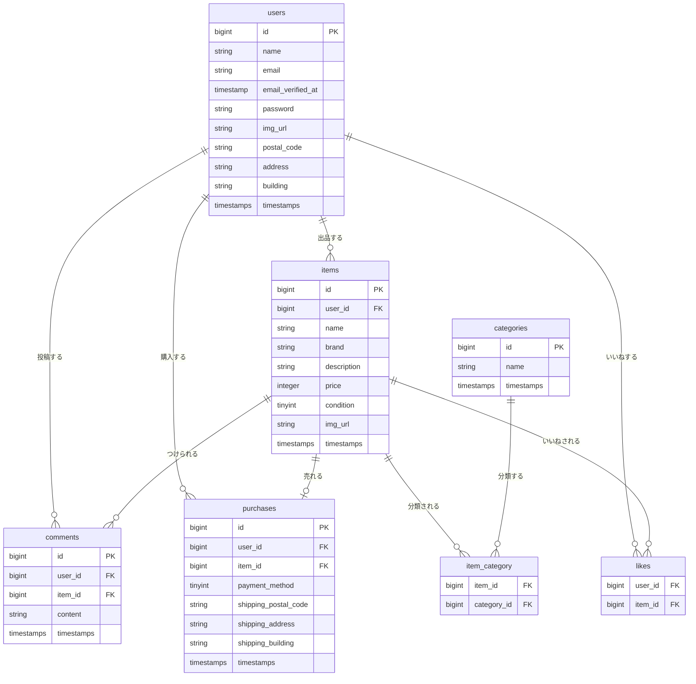

# flea-market-app

## 環境構築

### Dockerビルド

- git clone https://github.com/kayame0120-code/flea-market-app.git
- cd flea-market-app
- docker-compose up -d --build

### Laravel環境構築

- docker-compose exec php bash
- composer install
- cp .env.example .env
- .envの以下の項目を変更する
  - DB_HOST=mysql
  - DB_DATABASE=laravel_db
  - DB_USERNAME=laravel_user
  - DB_PASSWORD=laravel_pass
- php artisan key:generate
- php artisan migrate
- php artisan db:seed

### 権限設定（必要な場合）
- sudo chown -R $USER:$USER src
- chown -R www-data:www-data storage bootstrap/cache
- chmod -R 775 storage bootstrap/cache

## 開発環境

- 商品一覧画面：http://localhost:8063/
- 会員登録画面：http://localhost:8063/register
- phpMyAdmin：http://localhost:8083/

## 使用技術（実行環境）

- PHP 8.x
- Laravel 8.x
- MySQL 8.x
- nginx 1.x

## ER図

## URL

- 開発環境：http://localhost:8063/
- phpMyAdmin：http://localhost:8083/
